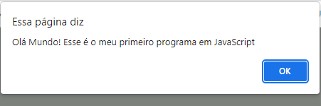
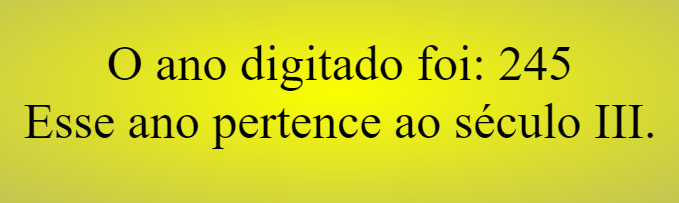

# Exercicios.js
Exercícios em Linguagem de Programação JavaScript

***
~~~javascript
    
~~~

### Saída

***

~~~javascript

~~~

### Saída

***
~~~

~~~

~~~

~~~

## Autor

Adalto Carvalho Ribeiro Simão Jr

