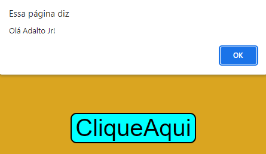

# Exercicios.js
Exercícios em Linguagem de Programação JavaScript

***
~~~javascript
    
~~~

##### Saída

***
#### Operadores Aritiméticos:
(+) Soma

(-) Subtração

(*) Multiplicação

(/) Divisão Real

(%) Divisão Inteira

(**) Potência

#### Operadores Relacionais:
(>) Maior..

(<) Menor..

(==) Igual (valores iguais)..

(!=) Diferente..

(>=) Maior ou Igual..

(<=) Menor ou Igual..

(===) Identidade (tipos iguais)..

#### Operadores Lógicos:
(&&) Conjunção, situação só é verdadeira se, somente se, as duas proposições forem verdadeiras.

( || ) Disjunção, situação só é verdadeira se, somente se, pelo menos UMA proposição for verdadeira.

( ! ) Negação, nega o resultado apresentado.

***
#### Exemplos de Métodos: 
~~~javascript

~~~

***
#### Exercícios [3]:
~~~javascript
<!--Crie uma pequena página em HTML que exiba um botão. Quando este botão for clicado, um comando
javaScript deve exibir uma janela de alerta exibindo seu nome.-->
<body>
    <input type="button" value="CliqueAqui" id="btn" onclick="clicar()">
    
</body>
~~~

##### Saída

***
~~~javascript
<!--Criando uma Calculadora OnLine-->
<body>
    <form>
        <h2>Calculadora Online</h2>
        <h4>Digite um valor (numerador):</h4>
        <input type="number" name="n1" id="n1"> 
        <h4>Digite outro valor (divisor):</h4>
        <input type="number" name="n2" id="n2">
        
        <h4>Escolha o operação a ser realizada:</h4>
        <input type="button" id="btn" value="Somar" onclick="somar()"> <!--Chama a função ao clicar-->
        <input type="button" id="btn" value="Subtrair" onclick="subtração()"> 
        <input type="button" id="btn" value="Multiplicar" onclick="multiplicação()"> 
        <input type="button" id="btn" value="Dividir" onclick="divisão()"> 
        
! Para calcular raiz ou potêcia só digite o primeiro valor (numerador)

        <input type="button" id="btn" value="Raiz" onclick="raiz()"> 
        <input type="button" id="btn" value="Potência" onclick="potencia()"> 
        

        
Resultado..

        

        <input type="reset" value="Resetar"> 
    </form>
   
 
</body>
~~~ 

~~~css

~~~

##### Saída

***
~~~javascript

~~~

##### Saída

***
~~~

~~~

~~~

~~~

## Autor

Adalto Carvalho Ribeiro Simão Jr

